# Milano tur retur 2017

## Fredag den 24. marts 2017

Dagen starter klokken 03:30, hvor vækkeuret ringer.
Vi skal være i lufthavnen klokken fem.
Det meste er pakket dagen i forvejen, så vi når næsten afted til tiden.
Vi er i Kastrup klokken fem, som planlagt, så der er fin tid, til flyet går klokken halv syv, vi har kun håndbagage.
Vi skal med AirBerlin og skal mellemlande i Düsseldorf.

Flyet er en lille halv time forsinket fra Kastrup, så det er lidt snært med tid i Düsseldorf.
Det bliver ikke bedre af at stewarden taler så utydligt,
at man ikke forstår meget andet end ordet Milano og noget mere.
Sandsynligvis var budskabet at man skulle blive i shuttlebussen og ikke panikke ud på første stop.

Hvis man gør det, forventes man åbenbart at blive i Düsseldorf, hvilket ikke giver mening!
Så skal man gennem security igen og spæne gennem hele lufthavnen for at finde afgangsgaten i den anden terminal.
Nu ved vi hvad en SpuhrHund von Düsseldorf laver, der er eddermaneme mange trapper og korridorer i den lufthavn.
Vi ankommer til gate B80 syv minutter før afgang,
og bliver kørt med shuttlebus ud til præcis det samme fly,
med præcis den samme besætning, som så flyver os til Milano!

Måske et lille dejavu for deltagere på Jægerspriskorets Islandstur.

Klokken ti lander vi i Milano Linate. Der går en bus 73 fra lufthavnen til centrum, det tager ca. 30 minutter.
Det skiltes der selvfølgelig ikke til, men den søde dame i information fortæller os at den går fra udgang otte,
og billetterne skal købes i aviskiosken.

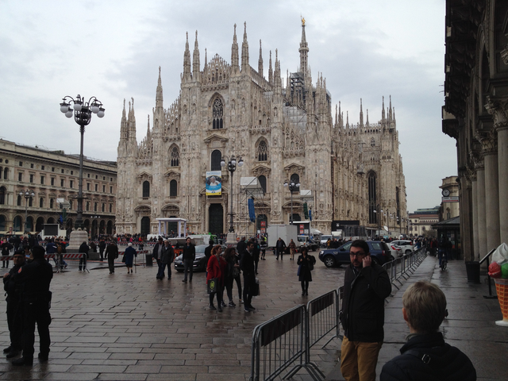

Fra bussens endestation er der ti minutters gang rundt om domkirken til vores hotel.
Værelserne er ikke klar endnu, det skal de heller ikke være før kl. tre, så vi stiller bagagen i receptionen.
Receptionisten lover at den bliver stillet op på værelse 207 når det er klar, ved et-tiden.
Det har vi vist ikke oplevet før.

Det er ikke helt nemt, for ikke at sige umuligt, at finde et sted i Milano, der vil servere frokost før tolv.
Til sidst sætter vi os på en café og venter på at de åbner køkkenet.
Tjeneren har ikke noget menukort, men løber ud og spørger kokken hver gang.
Men så er maden også både frisk og god.

Efter den ægteskabsbevarende frokost returnerer vi til hotellet, hvor bagagen er på værelset og vi får en nøgle.
Et kort pitstop gik turen til domkirken, som desværre er lukket for resten af dagen på grund af pave Frans besøg i Milano imorgen lørdag.
Men den åbner igen imorgen eftermiddag, så det er ok.

Hjemmefra har vi i et anfald af midlertidig sindssyge og overmod bestilt pladser på Teatro della Scala.
Det blev Wagners "Mestersangerne fra Nürnberg" (dog ikke Düsseldorf), den tager heldigvis kun fem timer.
Men billetterne skal hentes i "The box office", som ligger ... nej ikke i la Scala's bygning, men ... 
nede i metrostationen ved domkirken. Er der et skilt på la Scala?
Nej det er der jo ingen grund til, for det ved alle jo!
Men manden i la Scala's kiosk var ret træt af spørgsmålet og tilsvarende uhøflig.

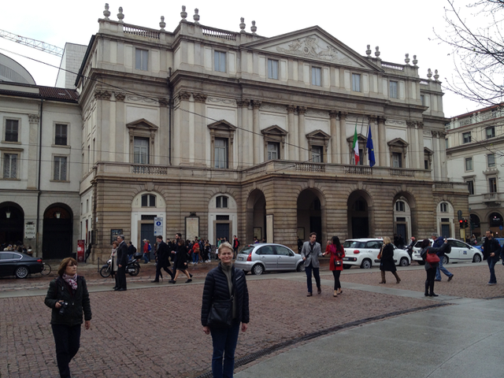

Billetterne bliver hentet hos en mand, der sidder med ca. halvtreds konvolutter med bestilte billetter,
som han så nøjsommeligt bladrer igennem fra ende til anden, for at finde vores konvolut.
Måske skulle nogen lære ham om alfabetet og dets fortræffeligheder en dag.
Da vi nu er i metroen, køber vi også en todages billet til hver.
Den gælder til al offentlig transport i det meste af Milano og koster 8,25€.

Hjemmefra har vi også reserveret billetter til da Vinci's den sidste nadver.
Det er først kl. 16:45 så vi fordriver tiden med at gå op til Castello Sforzesco,

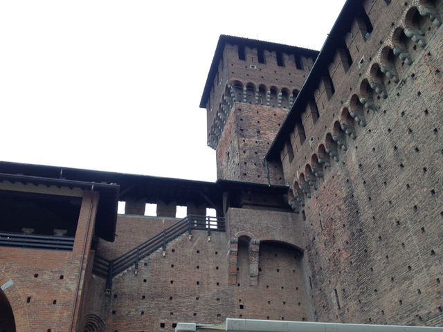

En borg fra renaisancen som er monster stor og monster dyster og ligger i en helt fortryllende park.
Borgen indeholder også en halv snes museer, dem skal vi se nogen af imorgen.

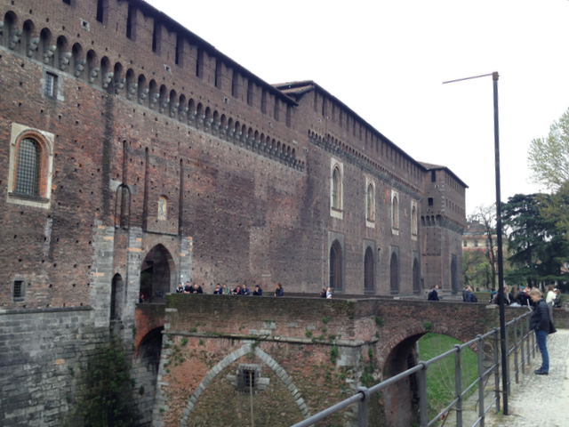

Da vi når til Santa Maria delle Grazie, hvor maleriet pryder den ene endevæg i munkenes spisesal,
er der stadig femogtyve minutter til rundvisningen.

Det skal lige siges, at der kun bliver lukket 30 besøgende ind til maleriet hver kvarter,
så man **SKAL** bestille tid, og man skal være der til tiden.
For godt ti år siden, hvor vi var i området sammen med Lindegaard, og trafikken drillede,
måtte Anders og Jacob smide koner og børn af så de i det mindste kunne nå "vinduet".
Anders og Jacob måtte nøjes med at parkere biler - ingen nadver til dem!

Her står vi så med vores voucher, en flink mand siger, at vi bare skal stille os til venstre eller til højre for hovedindgangen,
så kommer der en med vores rigtige billetter.
Vi bliver en anelse utrygge, det står der ikke noget om på voucheren, men selv efter en kontrolhenvendelse i billetlugen,
er bekskeden den samme.
16:40 er vi lidt mere end en anelse utrygge.
Men så dukker manden op, og vi bliver udstyret med radiogrej og en lidt forvirret men ganske vidende guide.

Konklusionen på den tur er; at italienere er noget for sig selv, og at den sidste nadver fortjener at blive set i det rum,
maleriet er lavet til.
Hvis man stiller sig halvt nede i salen, midt i, smelter perspektivet i billedet og rummet sammen, og man bliver en del af scenariet.

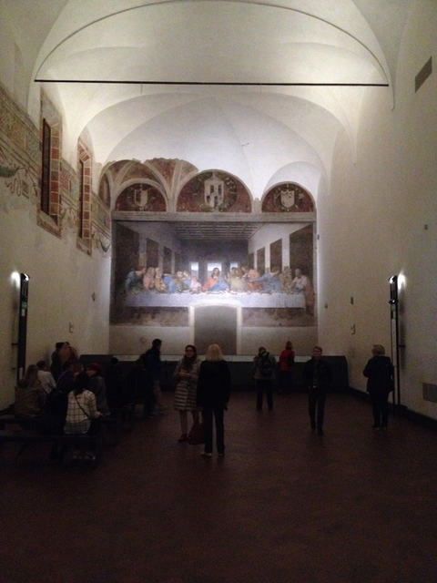

På vejen hjem må vi lige se de romerske søjler foran og mosaikkerne fra det 5. århundrede indeni San Lorenzo Maggiore kirken.

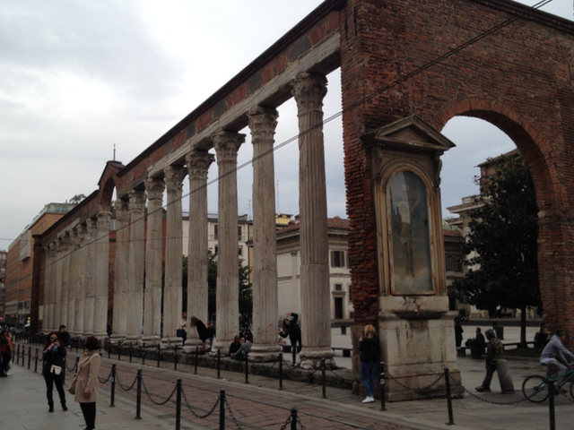

Ømme fødder, linie 3 går lige til døren.
45 minutter på hotellet derefter rundt om hjørnet til pizzaer fra en brændefyret stenovn, hvidvin, dessert,
og selvfølgelig espresso og grappa.

Lang dag :-)

## Lørdag den 25. marts 2017

Idag stod vi først op klokken otte, det var rart.
Hotellet ligger omkring 100 meter fra il Duomo, hvor paven skal tale klokken elleve,
alligevel er der allerede kvart over ni kø helt herned.

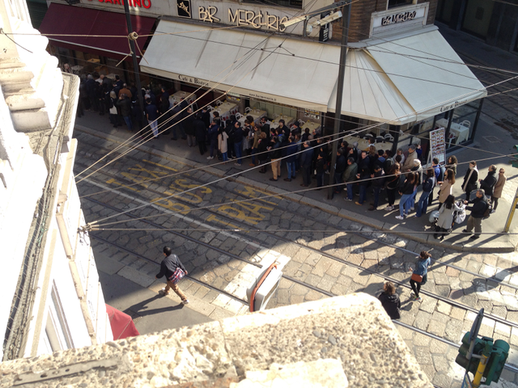

Morgenmaden på hotellet er ikke til fem tykmælksskåle på Christians skala,
men teen var stærk og kaffen god.
Vi opgav at høre pave Frans, vi er ikke særligt glade for at stå i kø.
Istedet begav vi os mod Milanos besdste kunstudstilling i Pinacoteca di Brera.
På vejen skal vi dog lige se om paven ville blive helt alene uden os.
Det så ikke ud til at være tilfældet, vi tror Donald Trump ville have givet sin højre hånd (han siger den er ret stor)
for halvt så mange tilhørere til sine taler.

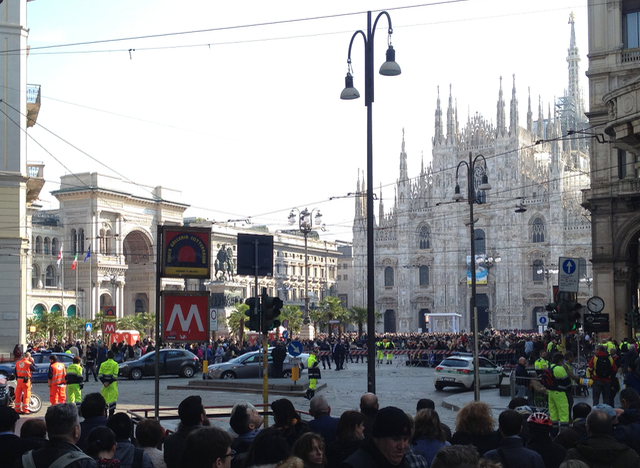

Napoleon mente, at der manglede et ordentligt kustmuseum i Milano.
Han bad derfor alle betydende italienske familier om at donere nogen **gode** billeder,
helt frivilligt selvfølgelig, til samlingen.
De færreste mente, at det var befordrende for deres fremtid ikke at efterkomme ønsket.

Det er der kommet en fremragende samling ud af, faktisk en af de bedste i Italien.
Bl.a. dette ret kendte billede af den døde Jesus:

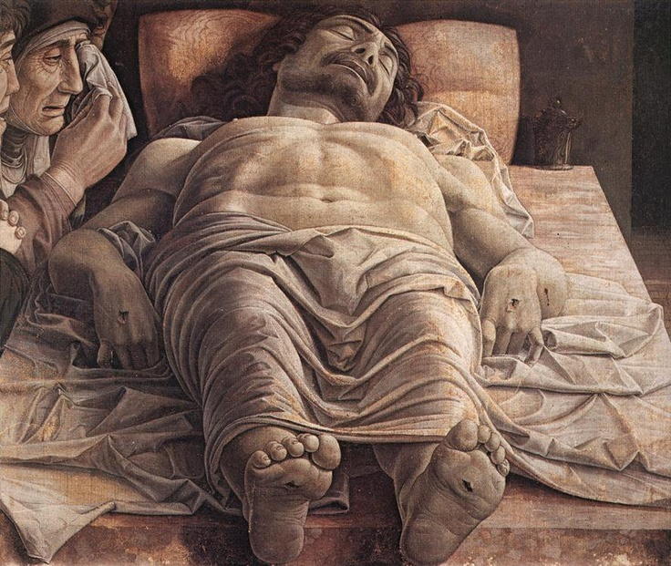

Men der var også ret koldt på Brera, så vi må finde en lille restaurant med servering i solen.
Det lykkedes, restauranten vi finder påstår, at de laver al deres mad fra grunden.
Det smager også sådan, vi får en pastaret med jomfruhummermousse, til gengæld havde de ikke kaffe.
Italienerne bliver mere og mere uforståelige.

Næste stop er Castello Sforzesco, denne gang museerne, der er otte af dem.
Vi havde dog valgt tre ud, men bliver lokket igennem et par stykker mere.
Et med italiensk møbelarkitektur gennem tiden er faktisk ret godt skruet sammen.
Et af dem vi havde valgt, musikinstrumentmuseet kan vi ikke finde indgangen til.
Vi får dog set Michelangelos ufærdige Pieta.

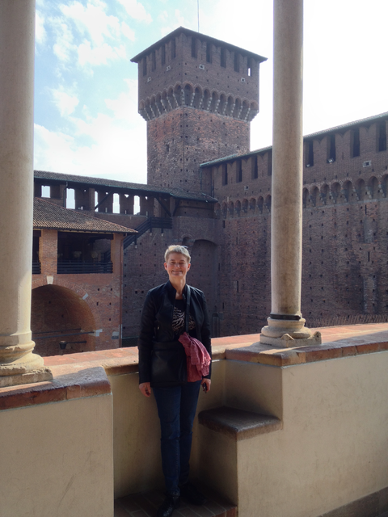

På vejen hjem ligger der en lille reneaissancekirke med nogen meget velholdte fresco'er (kalkmalerier).
Den er meget smuk og meget mere overskuelig end Castello Sforzesco.
I forbindelse med kirken ligger der et lille arkæologisk museum.
Anna er lidt træt i benene og gider ikke rigtigt, måske ihukommende et lignende museum i Volterra,
der viste sig at udstille flere tusind estruskiske urner.
Men der er en model af Milano fra romertiden, kan man se udefra,
så Anders må lige ind, det er jo bare et lille museum.
Modellen er rigtig fin og museet er fakstisk bygget i forbindelse med resterne af Mediolanums (Milanos navn i romertiden) hippodrom.
Resterne er to ganske velbevarede tårne.

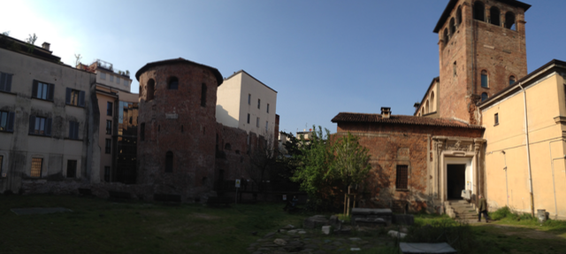

Muset er viser det sig, er ikke så lille endda,
der er en skjult bygning med en etage med ting fra barbarerne,
en etage med etruskiske ting (sikkert urner), en med romerting og en med græske vaser.
De springes klogeligt over.

I stedet finder vi en café og får en te, en dobbelt espresso og to croissanter.

Metroen tilbage til Duomo, hvor vi stiller os i kø for at få billetter til kirken og taget.
Så kom vi alligevel til at stå i ikke bare en kø, for der er både kø ved billetlugen og ved indgangen.
Køen ved billetlugen er den mest uforståelige, det tager ualmindeligt lang tid.
Der er kun fire produkter, som ganske vist kan kombineres: domkirke, museum, tur på taget med elevator og tur på taget ad trappen.
Hver ekspedition tager flere minutter, hvorfor? og hvorfor åbner de ikke den sidste luge?
Fordi billetprinteren ikke kan følge med! Det er ren sundhed-splatform!

Nummer to kø går betydelig hurtigere, der skal vi bare sikkerhedscheckes.
Kirken er imponerende, rundetårn kan mageligt stå derinde.
Der er plads til 40.000 mennesker, så køerne synes ikke af meget, når de først er kommet ind.
Der er kommet nyt lys derinde, så kirken ikke ser så dyster ud mere, og man kan se hvor mange detaljer, der også er inde i kirken.
På kirkens spir står den hellige jomfru og velsigner byen, nu er der kommet en 1:1 kopi inde i kirken.

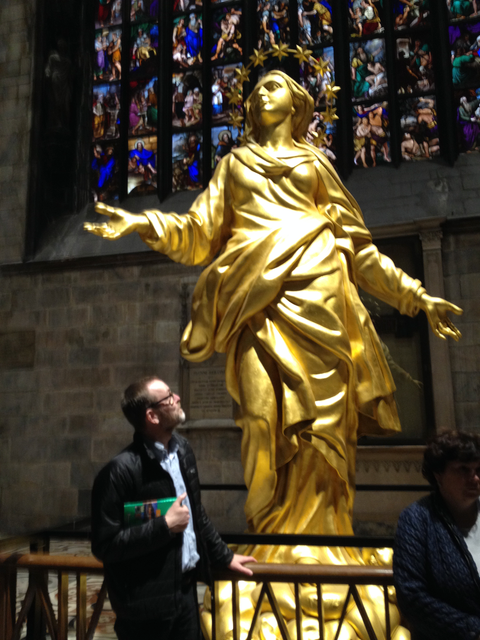

Den gamle statue af Bartolomæus, der som bekendt blev flået levende, står stadig på sin plads:

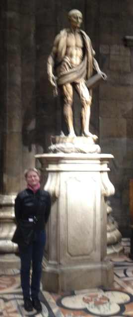

Billedet er desværre blevet en smule uskarpt,
så det kan være svært, at se, at det er hans egen hud, han har slængt over skulderen.
Godt der er en læge tilstede.

Over for domkirken er der en "Megastore" med alt fra børnebøger over computere og kameraer
til et musikmarked med CD'er og nyoptrykte LP'er.
Her køber vi nogen kolde øl og vand og tager hjem til hotellet og smækker stængerne op en timestid inden middagen.
Den indtager vi på den samme restaurant, som igår.
Vi skiftede dog pizzaerne ud med pasta med karl-johan og små pølser.
Ingen udskiftning i desserten og grappaerne.

## Søndag den 26. marts 2017

Fortsættelse følger ...
